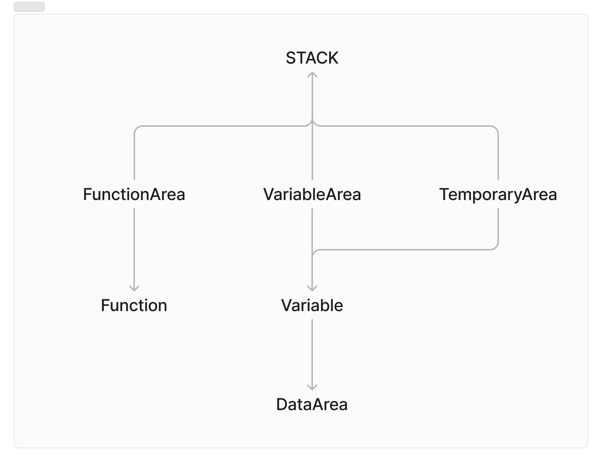

# MINI CODE

MINI CODE는 수학적인 표현을 최소화 하고 직관적인 예약어를 사용하여 처음 개발을 시작하는 사용자들이 프로그래밍의 깊은 이해를 할 수 있도록 설계된 프로그래밍 언어입니다.
이 언어는 사용자와 상호작용하고, 데이터를 처리하며, 조건부로 명령을 실행할 수 있도록 도와줍니다.
MINI CODE는 사용자들이 프로그래밍의 기본 개념을 명확히 이해할 수 있도록 설계되었습니다.

## 주요 특징
- **직관적인 예약어:** 이해하기 쉬운 예약어를 사용하여 프로그래밍의 기본 개념을 쉽게 배울 수 있습니다.
- **명확한 조건문(if):**  조건문을 통해 명령어의 실행 여부를 제어하며, 조건이 0보다 큰 경우에만 명령이 실행되는 명확한 규칙을 가지고 있습니다.
- **유연한 함수 정의:** 특정 작업을 반복적으로 수행할 수 있게 하는 함수 기능을 제공하며, 매개변수를 활용해 다양한 연산을 수행할 수 있습니다.
- **개발의 깊은 이해:** 프로그래밍의 기본 원리를 이해하고, 복잡한 문제를 해결하는 능력을 기를 수 있습니다.


# 실행 방법(윈도우 기준)
1. minicode.c 파일을 c++로 컴파일 합니다.
```
c++ minicode.cpp
```
2. 컴파일된 minicode.cpp 파일을 실행합니다.
```
./a.exe test.mini
```


# 문법

## 변수 선언 및 자료형
- **num:** 숫자 데이터를 저장합니다.
- **str:** 문자열 데이터를 저장합니다.
- **bool:** 논리값을 저장합니다(true 혹은 false).

### 기본 예제
```
num data1 30
str data2 "it is str"
bool data3 true
```
## 동작 설명
### 변수 선언과 임시 저장
- **num data1 30:** data1 이라는 이름의 숫자 변수에 숫자 30을 할당하고, 이를 변수 영역에 저장합니다. 
- **str data2 "it is str":** data2 라는 이름의 문자열 변수에 문자열 "it is str"을 할당하고, 이를 변수 영역에 저장합니다.
- **bool data3 true:** data3 이라는 논리 변수에 true를 할당하고, 이를 변수 영역에 저장합니다.


## 출력(out)
"out" 명령어는 화면에 출력하는 역할을 합니다. 이 명령어는 정보를 사용자에게 전달하거나, 사용자와 상호작용하는 데 사용되는 기본적인 도구입니다.

### 기본 예제
```
out "Hello, World!"
```
위의 예제에서는 문자열 "Hello World!"를 화면에 출력합니다.

### 고급 예제
```
str greeting "Hello "
str name "Mini"
str punctuation "!"

out greeting
out name
out punctuation
```
위의 예제에서는 여러개의 문자열 변수를 출력합니다. 각 변수는 따로 출력되며 출력된 결과는 "Hello Mini!"가 됩니다.

## 주석
주석은 설명을 다는 역할을 합니다. minicode는 #을 만나게 되면 해당 줄은 실행하지 않습니다.

### 기본 예제
```
# out "Hello, World!"
```
위에 예제에서는 아무것도 실행되지 않습니다.

## 개행(next)
"next" 명령어는 출력을 할 때 줄을 바꾸는, 즉 개행을 수행하는 역할을 합니다. 이를 통해 새로운 줄에서 출력을 시작할 수 있습니다.

### 기본 예제
```
out "Hello, World!"
next
out "This is a new line."
```
위의 예제에서는 "Hello, World!"를 출력한 후 줄을 바꿔 "This is a new line."을 출력합니다.

출력 결과는 다음과 같습니다
```
Hello, World!
This is a new line.
```

### 고급 예제
```
next out "Hello, World!"
next out "This is a new line."
```
위의 예제에서는 각 문장이 출력된 후 줄을 바꿉니다.

출력 결과는 다음과 같습니다.
```
Hello, World!
This is a new line.
```


## 입력(in)
"in" 명령어는 사용자로부터 데이터를 입력받아 변수에 저장하는 기능을 합니다. 이를 통해 프로그램이 사용자와 상호작용할 수 있습니다.

### 기본 예제
```
num age in
```
위의 예제에서는 사용자로부터 숫자를 입력 받아 age 변수에 저장합니다.
```
str name in
```
위의 예제에서는 사용자로부터 문자열을 입력 받아 name 변수에 저장합니다.

### 고급 예제
```
out "Enter your name: "
str name in

out "Enter your age: "
num age in


out "Hello "
out name
out "!"
next 

out "You are "
out age
out ", years old."
```
위의 예제에서는 사용자로 부터 이름과 나이를 입력 받고, 입력 받은 이름과 나이로 인사 메시지를 출력합니다.
```
Enter your name: mini
Enter your age: 20
Hello mini!
You are 20, years old.
```


## 조건(if)
"if" 명령어는 조건에 따라 특정 명령어는 실행하거나 실행하지 않게 하는 제어문 입니다. 조건이 참(true)일 때만 명령어가 실행됩니다. 조건이 거짓(false)일 경우 명령어는 실행되지 않습니다.

### 기본 예제
```
next out "Hello if!" if false
```
위의 예제에서는 if false가 붙어 있으므로 "Hello if!" 라는 문자열은 출력되지 않습니다.

```
next out "Hello if!" if true
```
위의 예제에서는 if true가 붙어 있으므로 "test" 라는 문자열은 출력됩니다.

### 실행 조건의 세부 사항
"if" 문의 조건은 특히 이 언어에서는 조건이 0보다 클 때만 명령어가 실행된다는 점을 이해하는 것이 중요합니다. 조건이 0(false)이거나 0보다 작을 경우, 명령어는 실행되지 않습니다. 반대로 1(true)이거나 1보다 클 경우 명령어는 실행됩니다. 이를 통해 if 문이 어떤 상황에서 명령어를 실행하는지 명확하게 알 수 있습니다.

### 심화 예제
### 예제 1: 조건이 양수일 때
```
num data1 10
num data2 5
next out "data1 is greater than data2" if data1 - data2
```
위의 예제에서는 data1이 data2 보다 크므로 "data1 is greater than data2"가 출력됩니다.
이는 data1 - data2가 양수(0보다 큼)이기 때문입니다.

### 예제 2: 조건이 음수일 때
```
num data1 3
num data2 7
next out "data1 is less than data2" if data1 - data2
```
위의 예제에서는 data1이 data2 보다 작으므로, 조건이 거짓이 되어 "data1 is less than data2"가 출력되지 않습니다.

### 예제 3: 같은 값을 비교할 때
```
num data1 10
num data2 10
next out "data1 is equal to data2" if data1 == data2
```
위의 예제에서는 data1과 data2가 같으므로 "data1 is equal to data2"가 출력됩니다.
이는 value1 == value2는 1(true)이기 때문입니다.

### 실습 예제
```
out "Enter a number: "
num input in

next out "The number is greater than 10." if input - 10
next out "The number is 10." if input == 10
next out "The number is less than 10." if 10 - input
```
이 프로그램은 사용자가 입력한 숫자에 따라 적절한 메시지를 출력합니다.

### 예시 출력 결과
사용자가 15를 입력했을 때
```
Enter a number: 15
The number is greater than 10.
```

사용자가 10을 입력했을 때
```
Enter a number: 10
The number is 10.
```

사용자가 5를 입력했을 때
```
Enter a number: 5
The number is less than 10.
```


## 함수(function)
함수는 특정 작업을 수행하는 명령어 블록입니다. 이 언어에서 함수는 function 키워드로 시작하며 parameter 키워드로 매개변수 구역의 끝을 나타냅니다. 함수는 done 키워드를 통해 종료됩니다. stop 명령어는 중간에 함수 실행을 멈추고 값을 반환할 때 사용되지만, 필수는 아닙니다.

### 함수 정의
```
func add
    num data1
    num data2
    parameter

    stop data1 + data2
done
```
함수는 두개의 숫자 data1과 data2를 매개변수로 받아, 이들의 합을 반환합니다.

### 함수 호출 및 출력
```
next out call add 3 5
```
이 명령어는 add 함수를 호출하고, 3과 5를 매개변수로 전달하여 결과를 출력합니다. 최종적으로 8이 출력됩니다.

### 함수의 구조 설명
1. 함수 시작(func add)
- func 키워드로 함수 정의가 시작됩니다.
- add 는 함수의 이름입니다.

2. 매개변수 정의
- **num data1:** 첫 번째 매개변수로 숫자형 data1을 선언합니다.
- **num data2:** 두 번째 매개변수로 숫자형 data2를 선언합니다.
- **parameter:** 매개변수 구역의 끝을 나타냅니다 매개변수가 없어도 반드시 사용해야 합니다.

3. 함수 본문
- **stop daata1 + data2:** 함수의 실행을 중지하고, data1과 data2의 합을 반환합니다.

4. 함수 끝(done)
- 함수 정의가 끝났음을 나타냅니다. stop 명령어 없이도 done을 만나면 함수가 종료 됩니다.

### 매개변수가 없는 함수
```
func greet
    parameter
    next out "Hello, World!"
done

call greet
```
이 예제는 greet 라는 이름의 함수를 정의하며, 매개변수가 없고 "Hello, World!"를 출력합니다.

### 실습 예제
```
func print
    num data
    parameter
    stop 0 if data == 10
    next out "Good"
done

call print in
```
이 프로그램은 사용자가 입력한 숫자에 따라 조건에 맞춰 "Good"을 출력합니다. 함수는 10이 아닌 숫자가 입력되었을 때만 "Good"을 출력합니다.

### 예시 출력 결과
사용자가 10을 입력했을 때
```
10
```
이 경우 아무것도 출력되지 않습니다.

사용자가 5를 입력했을 때
```
5
Good
```
이처럼 함수를 통해 다양한 조건을 확인하고, 그에 맞게 출력 결과를 다르게 할 수 있습니다.

# 아키텍처
MINI CODE는 다음과 같은 주요 단계를 통해 프로그램을 처리합니다.
파일 로드, 구문 분석, 실행. 이 세 단계는 각각 특정 작업을 수행하며,
프로그램이 올바르게 실행될 수 있도록 합니다. 특히, MINI CODE는 인터프리터 방식으로 동작하여 각 단계가 순차적으로 실행됩니다.

**1. 파일 로드**
- 먼저, 프로그램 파일을 한 줄씩 읽어옵니다. 각 줄이 순차적으로 읽히며, 다음 단계로 넘어갑니다.

**2. 구문 분석**
- 파일에서 한 줄씩 읽어온 후, 해당 줄의 구문이 분석됩니다. 이 단계에서는 각 명령어와 그 구조를 검사하여, 프로그램의 문법이 올바른지 확인합니다. 구문 분석기는 각 줄의 명령어를 즉시 실행할 준비를 합니다.

**3. 실행**
- 구문 분석이 완료되면, 각 줄의 명령어가 바로 실행됩니다. 프로그램의 논리와 순서에 맞게 명령어가 실행되면서 최종적으로 사용자에게 결과를 출력합니다.


## 메모리 사용
실행 중에는 메모리가 다음과 같은 네 가지 주요 영역으로 나뉘어 사용됩니다.
데이터 영역, 변수 영역, 함수 영역, 임시 영역.

**1. DataArea**
- 데이터 영역은 프로그램에서 사용되는 모든 실질적인 데이터 값을 저장하는 영역입니다. 동적 배열을 기반으로 설계되었으며, 스택의 장점을 추가하여 효율적인 데이터 관리가 가능합니다. 또한, 이 데이터 영역은 Singleton 패턴으로 구현되어, 프로그램 내에서 단일 인스턴스만 존재하게 설계되었습니다.

**2. VariableArea**
- Variable 정보를 저장하는 영역입니다. 변수 영역은 Stack을 구현하며 Variable에 의존하고 있습니다. 이 영역은 Singleton 패턴으로 구현되어 프로그램 내에서 단일 인스턴스만 존재하게 설계되었습니다.

**3. TemporaryArea**
- 시스템에서 생성된 Variable 정보를 저장되는 영역입니다. 이 영역의 변수들은 일시적으로 사용되며, 사용 후에는 삭제됩니다. 임시 영역은 Stack을 구현하며 Variable에 의존하고 있습니다. 이 영역은 Singleton 패턴으로 구현되어 프로그램 내에서 단일 인스턴스만 존재하게 설계되었습니다.

**4. FunctionArea**
- Function 정보를 저장하는 영역입니다. 함수 영역은 Stack을 구현하며, Function에 의존하고 있습니다. 이 영역은 Singleton 패턴으로 구현되어 프로그램 내에서 단일 인스턴스만 존재하게 설계되었습니다.


## Stack
스택 자료구조의 장점과 동적배열 자료구조의 장점을 조합하여 만든 추상화 클래스 입니다.
스택의 장점인 push와 pop을 이용한 데이터 관리와 동적 배열의 장점인 index로 데이터에 빠르게 접근할 수 있도록 설계 되었습니다.
내부적으로는 Array로 구현되어 있으며, push와 pop을 사용하여 데이터 입출력이 가능합니다. 그리고 index를 통해 읽기 성능은 O(1)이 되며 동적배열과 같이 maxSize(배열의 크기)가 넘어가게 되면 자동으로 배열의 크기를 조절합니다.

## Variable
변수의 이름, 타입, 그리고 포인터 정보를 가지며, 이 포인터는 DataArea에 저장된 값을 가리킵니다. 메모리 누수를 방지하기 위해서는 포인터가 가리키는 데이터를 적절히 삭제해줘야 합니다.

## Function
함수 실행에 필요한 데이터를 모두 가지고 있습니다. 즉, 함수가 실행되기 위해 필요한 상태 정보와 데이터를 관리합니다.

